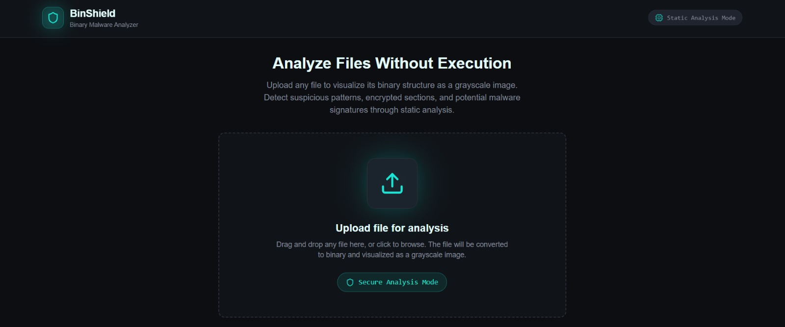

# 🛡️ BinShield

**BinShield** is a **static binary malware analyzer** that allows users to analyze files **without executing them**.  
It visualizes binary data as grayscale images and detects suspicious patterns using entropy analysis and static heuristics.

> 🔒 Safe-by-design: Files are never executed.

---

## 🚀 Live Demo

🔗 https://binshield.lovable.app/

---

## 🧠 Why BinShield?

Traditional malware analysis tools often require file execution, which can be dangerous.  
**BinShield eliminates this risk** by performing **pure static analysis**, making it ideal for:
- Security learners
- Malware researchers
- Hackathon demos
- Safe file inspection

---

## ✨ Features

### 📤 File Upload & Static Analysis
- Upload **any file type** (PDF, EXE, ZIP, etc.)
- No execution — analysis is fully static
- Secure analysis mode enabled by default

### 🖼️ Binary Visualization
- Converts binary data into a **grayscale image**
- Each pixel represents **1 byte**
- Brightness corresponds to byte value (0–255)
- Helps visually identify packed or encrypted regions

### 📊 Entropy Detection
- Calculates entropy score (0–8)
- High entropy indicates:
  - Encrypted content
  - Compressed binaries
  - Possible obfuscation

### 🚨 Risk Assessment
- Detects suspicious binary regions
- Flags files as **Low / Medium / High Risk**
- Displays number of suspicious segments detected

### 📁 File Metadata
- File name
- File type
- File size
- Last modified date
- SHA-256 hash

---

## 🧪 How It Works

1. User uploads a file
2. File is converted into raw binary data
3. Binary bytes are mapped to a grayscale image
4. Entropy is calculated across binary sections
5. Suspicious patterns are detected
6. Risk level is generated — **without executing the file**

---

## 🖥️ Screenshots

### 🔹 Upload & Static Analysis Mode


### 🔹 Binary Visualization & Risk Detection


### 🔹 File Metadata & Hash Information


---

## 🛠️ Tech Stack

- **Frontend:** React (Lovable)
- **Styling:** Tailwind CSS
- **Analysis:** JavaScript-based static analysis
- **Security:** Client-side binary processing

---

## 📦 Installation

```bash
git clone https://github.com/techytannu/binshield.git
cd binshield
npm install
